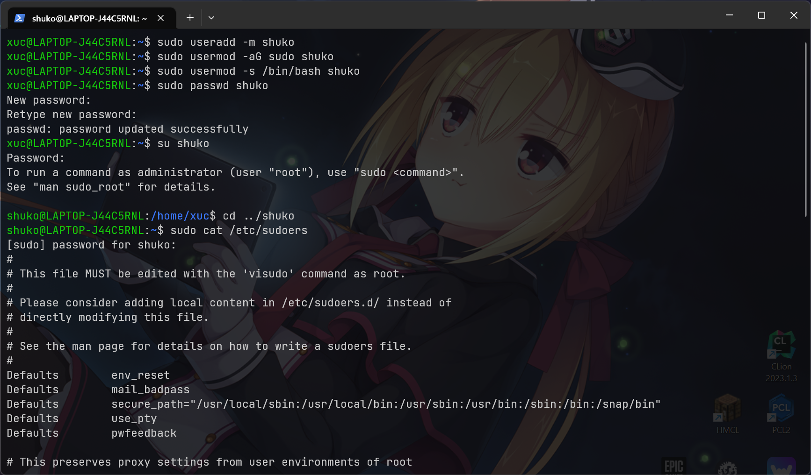
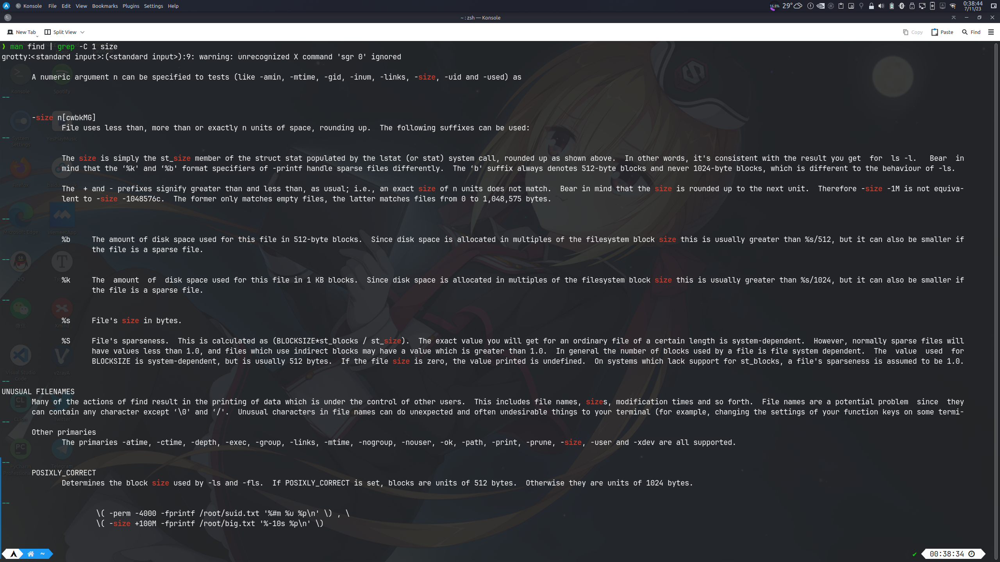
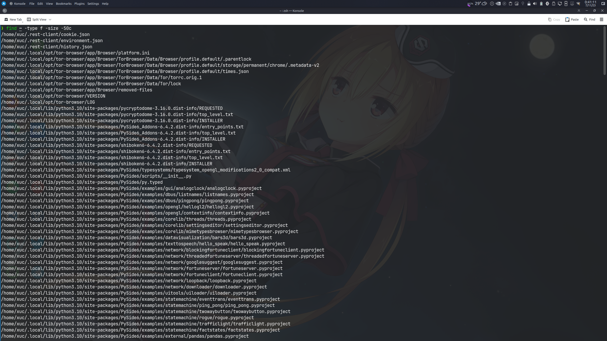

# Linux&Shell Homework

### 1. 新建用户

> 在Linux上新建一个用户并赋予超级用户权限，建立家目录并设置默认shell为bash，并设置Linux在输入sudo密码时显示星号。请提交全部命令及输出截图（表明完成需求即可）。

```sh
sudo useradd -m shuko
sudo usermod -aG sudo shuko
sudo usermod -s /bin/bash shuko
```

`/etc/sudoers`:

```sh
+ Defaults	pwfeedback
```



### 2. shell命令

> 使用`man find`命令查看手册，利用 grep 命令从中提取与 size 有关的内容，阅读该选项的使用方式。据此写出利用 find 命令查找家目录下小于50字节(bytes)的所有文件的指令。请将提取过程所用的指令以及最后的find指令写出，并将 grep 和 find 命令的输出内容截图（若grep较长，截取关键部分即可）。
>
> 提示：利用管道获取手册内容，利用 grep 的`-C`选项以阅读上下文。

提取过程所用的指令：

```sh
man find | grep -C 1 size
```



最后的`find`指令为：

```sh
find ~ -type f -size -50c
```



### 3. shell脚本练习

> 编写shell脚本，求1到100的奇数和，输出结果重定向到 result.txt。提交脚本代码即可。

```sh
sum=0
for num in {1..100..2}; do
    let sum=$sum+$num;
done
echo $sum > result.txt
```

